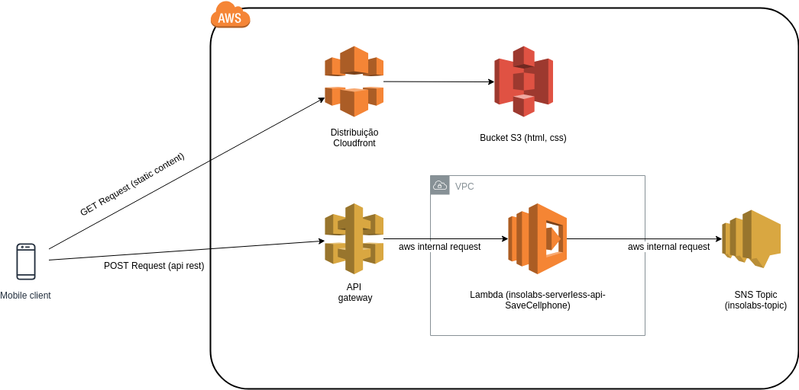
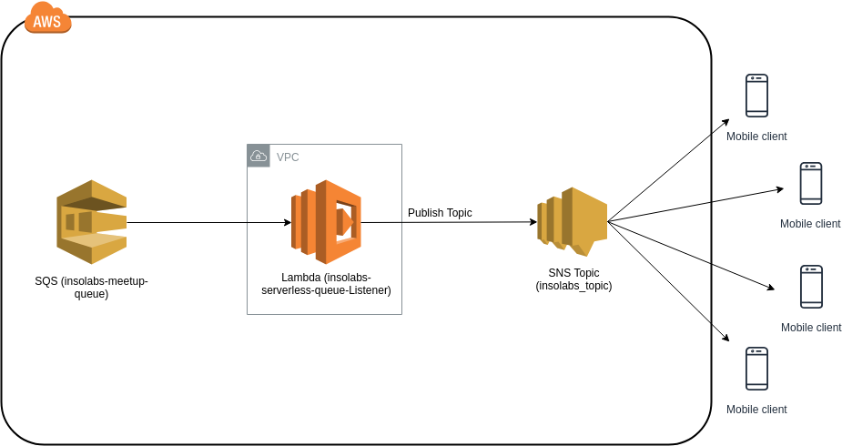

# insolabs_meetup_serverless #
Código fonte do [meetup](https://www.meetup.com/pt-BR/Insolabs/events/261136589/) apresentado dia 08/05/2019 por ***Milton Bertachini*** entre 19:00 e 20:00 no espaço oferecido pela [Trigg](trigg.com.br). A apresentação completa pode ser encontrada [aqui](meetup/apresentacao_completa.pdf).

## O que foi utilizado neste projeto? 
- [AWS Cloudformation](#criando-a-stack-cloudformation)
- AWS SNS 
- [AWS SQS](#arquitetura-sqs)
- AWS Lambda 
- [AWS ApiGateway](#arquitetura-apigateway)
- Java 8 
- Gradle 4.6 

### Gerando o Artefato ###
```shell
gradle build
```

### Configurando o Eclipse ###
Necessário instalar o [lombok.jar](https://projectlombok.org) na IDE e utilizar o comando:
```shell
gradle eclipse
```

### Criando a stack cloudformation ###
Toda definição da infraestrutura [AWS](https://aws.amazon.com/pt/) necessária para rodar essa demonstração está dentro de um arquivo [SAM Template](https://docs.aws.amazon.com/serverless-application-model/latest/developerguide/serverless-sam-reference.html) que pode ser encontrado [aqui](template.yml).

Para montar essa estrutura você deve executar o comando:
```shell
aws cloudformation package --template-file template.yml --s3-bucket [[SEU_BUCKET]] --output-template-file outTemplate.yml
```
Isso vai gerar o artefato *outTemplate.yml* que deve ser importado dentro do [AWS CloudFormation](https://aws.amazon.com/pt/cloudformation/) como um change-set de uma stack.


### Arquitetura ApiGateway ###

[Código Fonte Função Lambda](/src/main/java/com/br/insolabs/serverless/handler/api/SaveCellphone.java)

### Arquitetura SQS ###

[Código Fonte Função Lambda](/src/main/java/com/br/insolabs/serverless/handler/queue/Listener.java)

### Front-End ###
O front-end utilizado para essa demonstração pode ser encontrado [aqui](meetup/frontend).

Desenvolvido Por:
------------
[**@miltonhit** Milton Bertachini Neto](https://github.com/miltonhit)

**Contribuidores**
------------
[**@guimelotto** Guilherme Melotto](https://github.com/guimelotto) Front-End

**Agradecimento**
------------
[**@Insolabs** Guilherme Melotto](https://github.com/insolabs)
